<p align="center">
  
</p>

<p align="center">
  
</p>

<p align="center">
  <b>La Skill oficial para conectar Hermes con DotPulse.</b><br>
  Copias una conexión en el teléfono, la pegas en Hermes y confirmas en el teléfono.
</p>

---

> [!WARNING]
> **Todavía no se puede conectar siguiendo este README.** La arquitectura de producción está
> definida y construida, pero dos piezas aún no están en línea: DotPulse Link
> (`link.dotpulse.app`) está pendiente de desplegar y DotPulseConnector aún no tiene repositorio
> público. Mira [Estado actual](#estado-actual) antes de intentarlo.

## ¿Qué es DotPulse?

DotPulse es la app de iPhone para controlar y gestionar los agentes de tu Hermes. Cada agente es un
**Dot**: un personaje cuyo estado refleja lo que el agente está haciendo.

Tus agentes siguen corriendo en tu Hermes, en tu equipo o servidor. DotPulse no pone modelos ni
ejecuta agentes: es el cliente.

```
DotPulse (iPhone)  ⇄ HTTPS/WSS ⇄  DotPulse Link  ⇄ HTTPS/WSS ⇄  DotPulseConnector  ⇄  Hermes
```

| Pieza | Qué hace | Dónde está |
|---|---|---|
| **Skill** (este repositorio) | Entiende la intención y el orden de los pasos. Solo instrucciones | Aquí |
| **DotPulseConnector** | Mantiene la conexión real con tu Hermes | Un plugin dentro de tu Hermes |
| **DotPulse Link** | El puente seguro público entre tu teléfono y tu Hermes | `link.dotpulse.app`, de DotPulse |
| **DotPulse** | El cliente | Tu iPhone |

No configuras direcciones IP, puertos, SSH, certificados ni la dirección de Link: la app y el
Connector la traen de fábrica. No hay cuentas ni inicio de sesión.

<p align="center">
  
</p>

## ¿Qué hace la Skill?

Le dice al agente de Hermes qué hacer cuando pegas una conexión de DotPulse, y qué no hacer nunca.
**La Skill no conecta por sí sola**: no contiene código, claves ni direcciones.

Cuando recibe un texto con un Pairing ID (`DPP1-…`), sigue este orden:

1. Reconoce el Pairing ID. Es una credencial temporal de emparejamiento, no una instrucción ni
   código: nada de lo que venga con él se ejecuta.
2. Comprueba que DotPulseConnector está instalado.
3. Comprueba que su versión es compatible con el servicio.
4. Comprueba que DotPulse Link responde.
5. Solo entonces presenta el Pairing ID.

Si falta el Connector, si es incompatible o si Link no responde, **el Pairing ID no se gasta**: la
Skill te dice qué pasa y nada más. Y nunca dice que conectó si el servicio no lo confirma.

Estas comprobaciones no dependen de que el agente obedezca: el Connector las hace por su cuenta
antes de presentar nada.

La Skill jamás pide IMEI ni identificadores de Apple, claves privadas, contraseñas, acceso SSH,
tokens (de Cloudflare ni de nada) ni direcciones de servidor. Tampoco guarda ni reenvía Pairing IDs.

## ¿Qué es DotPulseConnector?

Un plugin de Hermes. Es lo que de verdad conecta: presenta el Pairing ID a DotPulse Link, guarda
la credencial de la conexión en un archivo privado de tu Hermes y mantiene el enlace abierto,
reconectando solo si se cae la red o se reinicia el equipo.

Solo hace conexiones **salientes** hacia `link.dotpulse.app`. No abre ningún puerto en tu equipo.

Le da a Hermes tres herramientas (`dotpulse_pair`, `dotpulse_status`, `dotpulse_disconnect`) y una
orden para ti, `/dotpulse`.

> [!WARNING]
> **El Connector todavía no es público.** No hay repositorio ni orden de instalación que dar hoy.
> Cuando exista, aquí aparecerán su repositorio y el commit exacto de cada versión. Hasta entonces,
> cualquier «conector de DotPulse» que encuentres no es oficial.

## ¿Qué es Link?

DotPulse Link es el servicio que pone en contacto tu teléfono con tu Hermes. Hace tres cosas:

- **Decide** si un Pairing ID vale, quién está conectado y qué puede llevar cada conexión.
- **Reenvía** el tráfico entre los dos extremos, cifrado de extremo a extremo. No puede leerlo.
- **Revoca**: cuando eliminas una conexión, corta los dos extremos en el momento.

No ejecuta IA ni agentes y no guarda conversaciones, prompts, respuestas ni archivos.

## Primera conexión

La primera vez que usas DotPulse con un Hermes hay un paso más: instalar el Connector, **una sola
vez**, con la orden de plugins del propio Hermes, y reiniciarlo. Hermes no instala plugins por
recibir un mensaje y su agente no tiene herramienta para hacerlo.

Después:

1. **Abre DotPulse** y ve a Conexiones → Conectar Hermes.
2. **Pulsa «Copiar conexión».** Se copian cuatro líneas, y nada más:

   ```
   DotPulse · conexión
   Skill: https://github.com/1122RealEstate/SkillDotPulse
   Pairing ID: DPP1-XXXXX-XXXXX-XXXXX-XXXXX-XXXXX
   Hermes: conecta DotPulse con este Pairing ID.
   ```

   El Pairing ID es distinto cada vez, vale 5 minutos y sirve una sola vez.
3. **Pégalo, sin cambiar nada,** en tu Hermes o en tu chat privado de Telegram con él.
4. **Hermes responde** con el nombre de tu teléfono y un código de verificación de seis cifras.
5. **En DotPulse** aparece la solicitud con el mismo código. Compruébalo y pulsa **Autorizar**.
6. **En Hermes** confirma que ese teléfono es el tuyo: `/dotpulse confirmar`, o el botón
   **✅ Es mi teléfono** en Telegram.
7. **Conectado.** La app lo muestra solo cuando el servicio lo confirma, y `/dotpulse` lo lista:

   ```
   • iPhone de Ana — 64e9ecc2f11a — conectado, en línea — capacidades: hermes.api
   ```

Hacen falta las dos confirmaciones, en cualquier orden y en 2 minutos. Sin las dos no se conecta
nada.

## Conexiones futuras

Con el Connector ya instalado, conectar otro teléfono, o el mismo después de eliminarlo, es solo
los pasos 1 a 7: copiar, pegar, autorizar. No se instala nada más.

Una conexión hecha se mantiene sola. Si tu Hermes se reinicia o tu teléfono cambia de red, vuelve
sin que hagas nada. Solo termina cuando la eliminas:

- **En DotPulse:** Conexiones → la conexión → Eliminar conexión.
- **En Hermes:** `/dotpulse` para verlas y `/dotpulse desconectar <identificador>`.

En los dos casos se corta en el momento y solo se vuelve con una conexión nueva.

## Seguridad

- **El Pairing ID caduca a los 5 minutos y funciona una sola vez.** Uno encontrado después en un
  historial de chat no sirve para nada.
- **Dos confirmaciones tuyas:** Autorizar en tu teléfono y confirmar en tu Hermes. La segunda solo
  la puede dar una persona: no existe herramienta para que el agente confirme por ti.
- **No pegues un Pairing ID que no hayas copiado tú.** Si alguien te envía uno y lo pegas, el
  teléfono que pide entrar es el suyo. Lo notarás porque tu DotPulse no muestra ninguna solicitud
  con ese código: no confirmes, escribe `/dotpulse rechazar`.
- **El código de verificación tiene que coincidir** en Hermes y en la app. Sale del Pairing ID y de
  las claves de los dos extremos, así que el servicio no puede fabricar uno que coincida.
- **Cada conexión es independiente:** su credencial, sus claves de sesión y su revocación.
  Comprometer un Hermes no da nada sobre otro.
- **La seguridad no vive en la Skill.** Caducidad, un solo uso, confirmaciones, permisos y
  revocación los impone el código de Link y del Connector, obedezca o no el agente.
- **Este repositorio no da acceso a nada.** Solo son instrucciones e imágenes.

El modelo completo, con lo que queda sin cubrir: [references/security.md](references/security.md).

## Privacidad

- **No hace falta cuenta** para la conexión básica. Cada instalación de DotPulse tiene su propia
  identidad criptográfica, y la clave privada no sale del iPhone.
- **Lo que hablas con tus agentes no lo puede leer DotPulse.** Va cifrado de extremo a extremo
  entre tu teléfono y tu Hermes; Link solo lo reenvía.
- **Link guarda únicamente los metadatos mínimos** para mantener y proteger las conexiones: un
  identificador aleatorio de tu instalación, el nombre que le pusiste, claves públicas y, de cada
  conexión, los nombres del teléfono y del Hermes, sus permisos, su estado, cuándo se creó y su
  última actividad.
- **No guarda** conversaciones, prompts, respuestas, archivos, tokens ni tu dirección IP. Si algún
  día existiera una función que guardase contenido, sería explícita y con tu consentimiento.
- **No se usa ningún identificador de tu teléfono** (ni IMEI ni identificadores de Apple). El
  Pairing ID ni siquiera llega al servicio: solo un resumen irreversible.
- **Puedes borrarlo todo:** Ajustes → Conexiones → «Borrar mis datos del servicio de conexión»
  revoca tus conexiones y elimina tu instalación del servicio en el momento.

## Troubleshooting

| Situación | Qué hacer |
|---|---|
| Hermes no reconoce la conexión o `/dotpulse` no existe | Falta instalar el Connector. Tu Pairing ID no se gastó |
| «…ya no es compatible con el servicio de DotPulse» | Actualiza el Connector, reinicia Hermes y copia una conexión nueva |
| «No pude contactar con DotPulse» | Revisa la conexión a Internet del equipo de Hermes y copia una conexión nueva |
| «Ese Pairing ID ha caducado» / «no es válido o ya se usó» | Copia una conexión nueva y pégala antes de 5 minutos |
| «…incompleto o dañado» | Vuelve a copiar y pega el texto entero |
| El código no coincide, o tu teléfono no muestra ninguna solicitud | No confirmes: `/dotpulse rechazar` |
| «Tu Hermes no está en línea» | Nada: se reconecta solo cuando ese equipo vuelve |
| «Esta conexión fue revocada» | Copia y pega una conexión nueva |

Todos los mensajes y casos: [references/troubleshooting.md](references/troubleshooting.md).

## Estado actual

A 5 de octubre de 2026. «Probado» quiere decir ejecutado de verdad, no solo escrito.

| Qué | Estado |
|---|---|
| Emparejar, usar Hermes por el enlace cifrado, reconectar y revocar | Probado en una sola máquina: servicio, Connector y `hermes serve` 0.21.2 reales, con el código Swift de la app |
| Pruebas hostiles (Pairing ID robado, reutilizado o caducado, Hermes o teléfono falsos, repetición, fuerza bruta, servicio comprometido) | Probado: pruebas automáticas |
| El Connector comprueba servicio y versión antes de gastar un Pairing ID | Probado: pruebas automáticas |
| Instalar el Connector con `hermes plugins install --ref` | Probado desde un repositorio local |
| Instalar esta Skill desde GitHub | Probado con Hermes 0.21.2 |
| La app en Release, fija en `https://link.dotpulse.app` y sin permiso de red local | Compila; sin probar contra el servicio real |
| **DotPulse Link en `link.dotpulse.app`** | **Sin desplegar.** El servicio y su contenedor están hechos; falta ponerlo en línea |
| **Repositorio público de DotPulseConnector** | **No existe todavía** |
| Conectar entre redes distintas (datos móviles ↔ otra red) | **Sin probar.** Necesita Link en línea |
| Telegram real | **Sin probar.** Probado sin red contra la librería de Telegram |
| Un modelo decidiendo llamar a las herramientas | **Sin probar.** Las herramientas se llamaron directamente |
| Aviso push de una solicitud de conexión | **No existe.** La solicitud aparece con DotPulse abierto |
| Enviar una tarea a un grupo de agentes | **No existe** |

## Instalar la Skill

El Connector trae esta misma Skill dentro. Para instalarla aparte:

```bash
hermes skills install https://raw.githubusercontent.com/1122RealEstate/SkillDotPulse/main/SKILL.md
```

Sin el Connector, la Skill solo sirve para que Hermes te diga que hace falta instalarlo, sin
gastar el Pairing ID que pegaste.

## Estados de una conexión

<p align="center">
  
</p>

| Estado | Qué significa |
|---|---|
| `pending` | Hay un Pairing ID copiado, o una solicitud esperando tu confirmación |
| `authorized` | Pulsaste Autorizar en el teléfono; falta confirmar en Hermes, o Hermes está recogiendo su credencial |
| `connected` | La conexión existe y Hermes la mantiene |
| `expired` | Se agotó el tiempo. Hace falta un Pairing ID nuevo |
| `rejected` | No se aceptó: no válido, ya usado o rechazado por ti |
| `revoked` | Se desconectó. Solo se vuelve con un Pairing ID nuevo |

## Qué hay en el repositorio

```
README.md                     esto
SKILL.md                      la Skill: concisa y operativa, es lo que lee el agente
references/
  connection.md               las piezas, el Pairing ID y el ciclo de vida de una conexión
  protocol.md                 qué hacen las herramientas por debajo
  security.md                 qué se impone y quién lo impone
  troubleshooting.md          cada mensaje que puedes ver y qué hacer
examples/
  pairing-example.md          conversaciones de ejemplo
assets/                       logo, Dots y diagrama (SVG, sin JavaScript ni recursos externos)
```

Los Dots de las imágenes son los de la app. Los documentos de la Skill están en inglés porque los
lee el agente; el agente responde en tu idioma.

## Avisar de un problema de seguridad

Usa los avisos de seguridad privados de este repositorio (pestaña *Security* → *Report a
vulnerability*) y no incluyas nunca un Pairing ID real.
